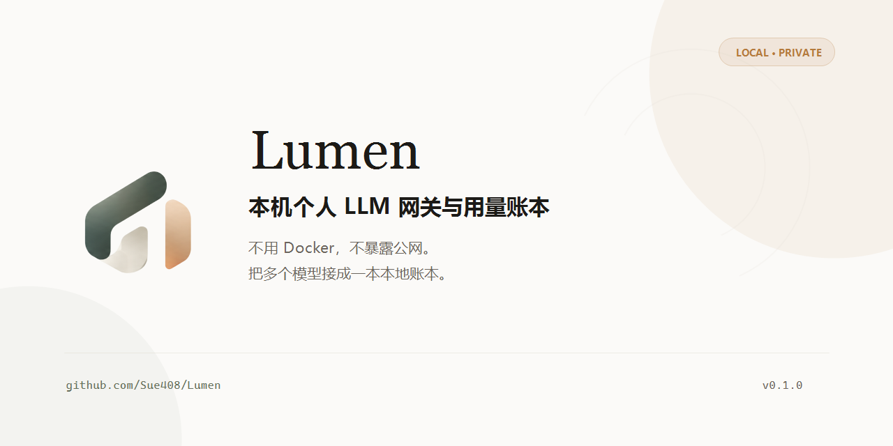
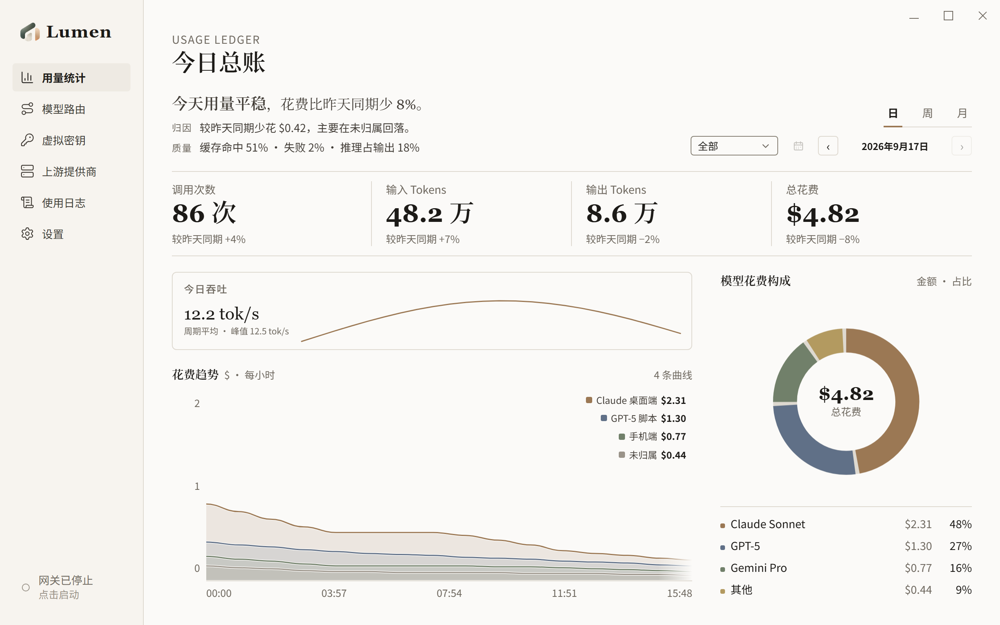
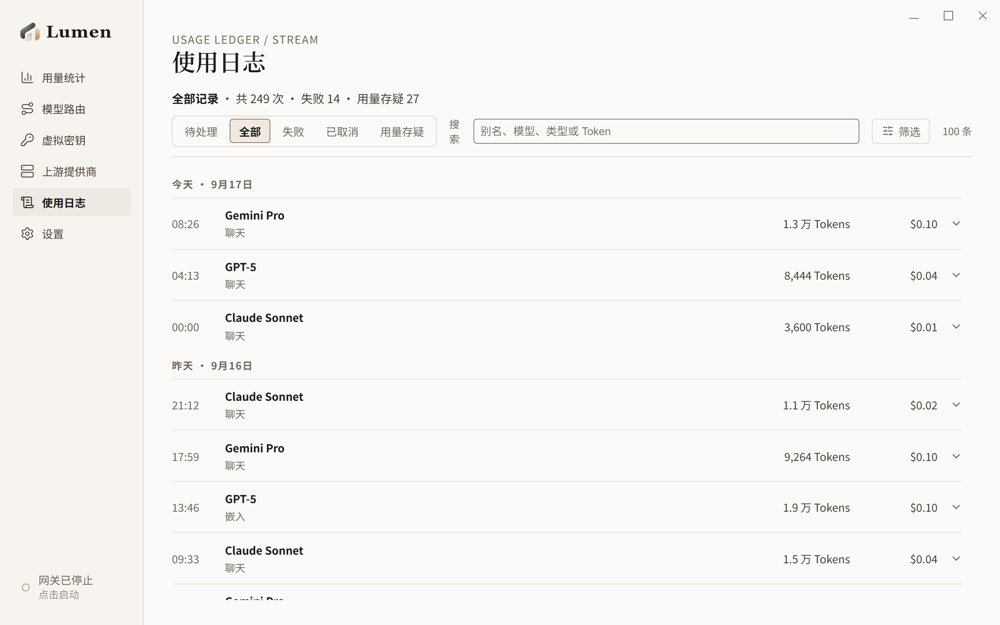
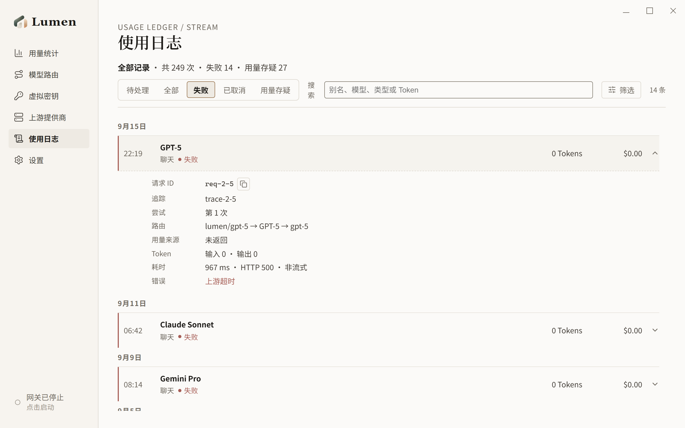
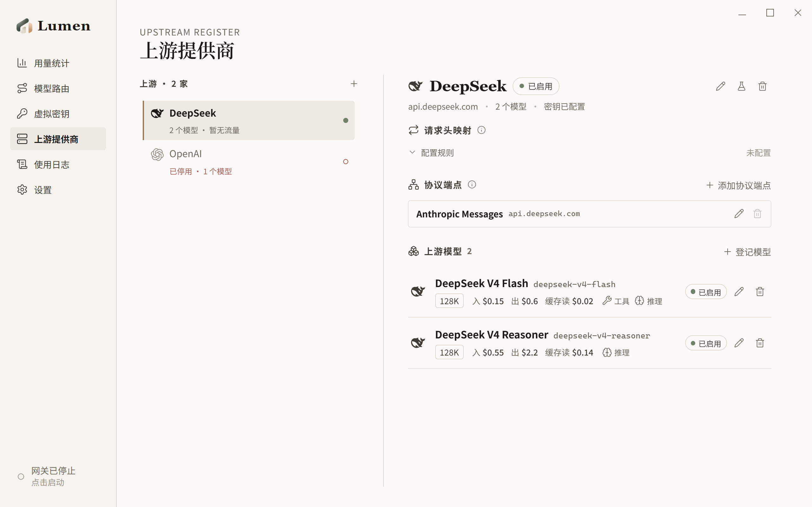
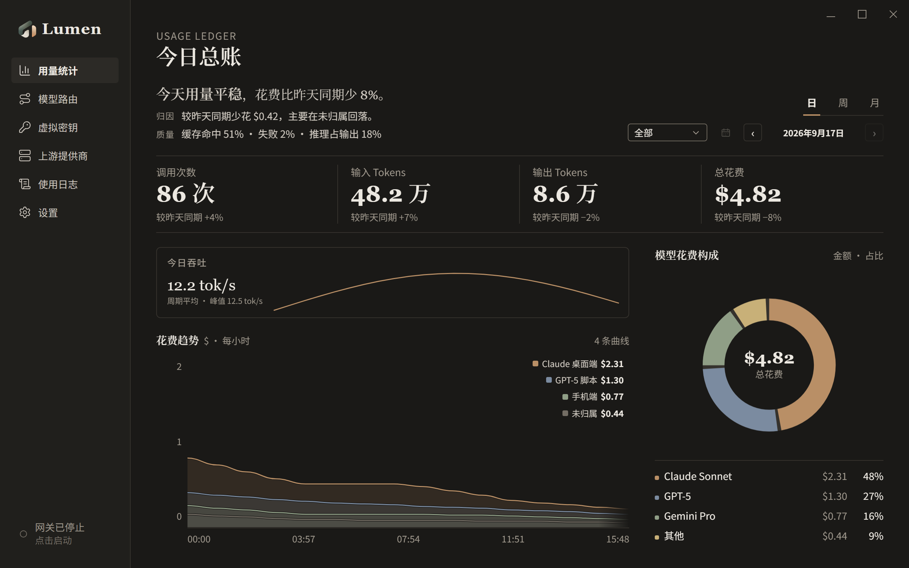

<p align="center">
  
</p>

<p align="center">
  <a href="README.en.md">English</a> | 简体中文
</p>

<h1 align="center">Lumen</h1>

<p align="center"><strong>运行在本机的个人 LLM 网关与用量账本。</strong></p>

<p align="center">
  <a href="https://github.com/Sue408/Lumen/releases/latest"></a>
  <a href="https://github.com/Sue408/Lumen/actions/workflows/ci.yml"></a>
  <a href="LICENSE"></a>
  
  
  
</p>

<p align="center">
  一个人的 AI 网关，不用搭一套中台。<br>
  不用 Docker、不暴露公网，把多个模型接成一本本地账本。
</p>



Lumen 把多个上游提供商聚合成统一的本地入口，按模型别名把请求路由到对应上游，并记录每一次调用的 token 与花费。它不负责团队治理、渠道分发或商业中转，只把“模型统一”和“账本归属”两件事做好。

## 核心能力

- **本地网关**：只绑回环 `127.0.0.1:8787`，默认关闭、显式启停，不需要服务器或 Docker。
- **别名路由**：客户端只记一个稳定别名；目标按优先级排列，主目标失败时按序切换。
- **用量记账**：单价按「每百万 token」存储，费用由网关计算；缓存读写、推理 token、失败尝试都进入账本。
- **使用日志**：按时段、别名、状态和用量可信度检索；错误按上游 / 网关 / 客户端归因。
- **本地优先**：配置、密钥和流水全部落本地 SQLite，升级走增量迁移。
- **为个人而做**：单用户、桌面应用、安静可翻查，不与 New API、LiteLLM 这类团队平台正面竞争。

## 界面

用量是总账，日志是流水。成功记录安静退到淡墨，异常才被拱到台面。



<p align="center">
  
  
</p>

<p align="center">
  
  
</p>

## 下载

首个公开版本为 `v0.1.0`。安装包发布后可从 [GitHub Releases](https://github.com/Sue408/Lumen/releases) 下载。

- 平台：Windows 10 / 11 x64
- 安装包：`Lumen_0.1.0_x64-setup.exe`
- 当前未接代码签名与自动更新，首次运行可能出现 Windows SmartScreen 提示。

## 快速上手

1. 启动 Lumen，在「上游提供商」添加上游端点和 API Key。
2. 在「模型路由」创建别名，并选择主目标与备用目标。
3. 在「虚拟密钥」创建自己的本地调用密钥。
4. 在「设置」启动网关，把支持 OpenAI 兼容接口的客户端指向：

```text
Base URL: http://127.0.0.1:8787/v1
API Key:  sk-lumen-...
Model:    你在 Lumen 中创建的模型别名
```

5. 调用一次后回到「用量统计」和「使用日志」查看 token、费用与请求链路。

## 开发

环境要求：Node.js、pnpm、Rust stable，以及 Tauri 2 的平台依赖，见 [Tauri prerequisites](https://tauri.app/start/prerequisites/)。

```bash
pnpm install
pnpm tauri:dev
```

`tauri:dev` 使用 `com.apnea.lumen.dev`，会与已安装的 release 版数据、单实例锁和自启动项完全隔离，因此两边可以同时运行。

```bash
pnpm test                     # 前端逻辑
pnpm build                    # 类型检查与前端构建
cargo test                    # 后端测试（于 src-tauri/）
cargo clippy -- -D warnings   # 后端静态检查（于 src-tauri/）
```

## 技术栈

- 桌面与后端：Tauri 2、Rust、axum、reqwest、rusqlite
- 前端：React 19、TypeScript、Vite，图表为原生 SVG
- 数据：SQLite，配置与流水同库，增量迁移见 `src-tauri/src/db/migrations.rs`

## 当前边界

- 面向个人本机使用，不提供多用户、组织权限、渠道分发或企业治理。
- 首个公开版本以 Windows NSIS 安装包为主，macOS / Linux 尚未作为首发交付目标。
- 不承诺覆盖所有提供商方言；未验证的协议与字段不会写进宣传承诺。
- 自动更新、代码签名和云同步暂缓。

## 参与

- 遇到安装、配置或调用问题：请提交 [Issue](https://github.com/Sue408/Lumen/issues)。
- 提交代码前请先读 [CONTRIBUTING.md](CONTRIBUTING.md)。
- 日志、配置和截图提交前必须移除 API Key、账号信息与真实账单数据。

## License

[MIT](LICENSE) © 2026 Apnea
